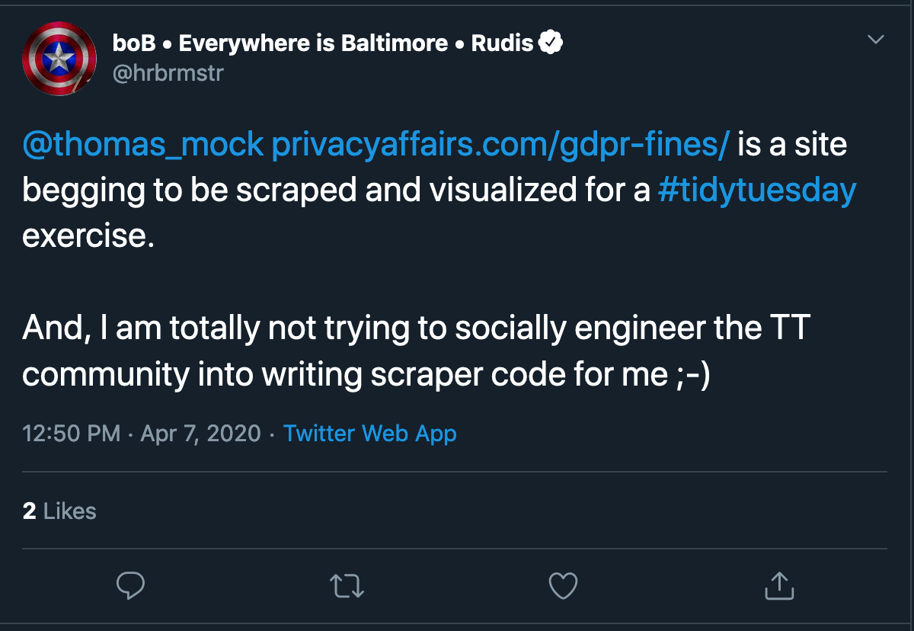
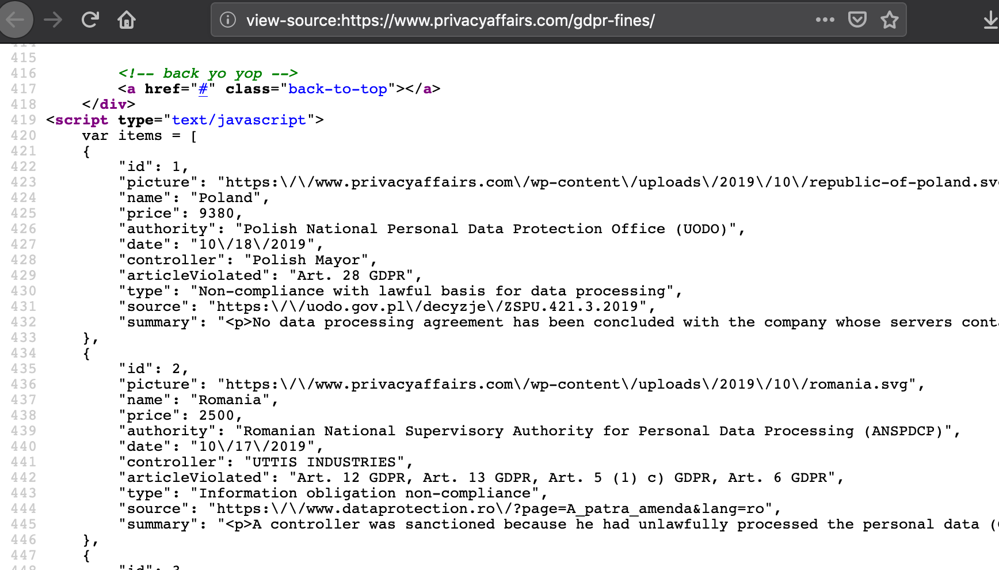
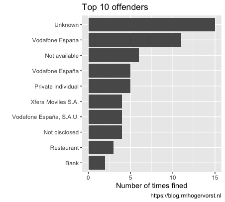

Scraping GDPR fines
================

*2020-04-08 Roel M. Hogervorst*

The website Privacy Affairs keeps a list of fines related to GDPR.

> All data is from official government sources, such as official reports
> of national Data Protection Authorities.

Bob Rudis (@hrbrmstr) tricked me into creating a scraper for this
website.

# Before you start

I first checked the
[robots.txt](https://www.privacyaffairs.com/robots.txt) of this website.
And it did not disallow me to scrape the website.

# The scraping

I thought this would be easy and done in a minute. But I’m not really
good at scraping it seems.

First I noticed that the website doesn’t show you all of the fines. But
when we look at the source of the page it seems it should be relatively
simple to retrieve the data, the data is in the javascript session (see
picture)

But extracting that data is quite some more work:

  - First find the \< script \> tag on the website
  - Find the node that contains the data
  - Realize that there are actually two datasources in here

<!-- end list -->

    library(rvest)
    link<- "https://www.privacyaffairs.com/gdpr-fines/"
    page <- read_html(link)
    
    
    temp <- page %>% html_nodes("script") %>% .[9] %>% 
      rvest::html_text() 

  - cry
  - do some advanced string manipulation to extract the two json
    structures
  - Read the json data in R

<!-- end list -->

    ends <- str_locate_all(temp, "\\]")
    starts <- str_locate_all(temp, "\\[")
    table1 <- temp %>% stringi::stri_sub(from = starts[[1]][1,2], to = ends[[1]][1,1]) %>% 
      str_remove_all("\n") %>% 
      str_remove_all("\r") %>%
      jsonlite::fromJSON()
    
    table2 <- temp %>% stringi::stri_sub(from = starts[[1]][2,2], to = ends[[1]][2,1]) %>% 
      str_remove_all("\n") %>% 
      str_remove_all("\r") %>%  
      jsonlite::fromJSON()

  - Profit

I also tried it in pure text before I gave up and returned to html
parsing.
